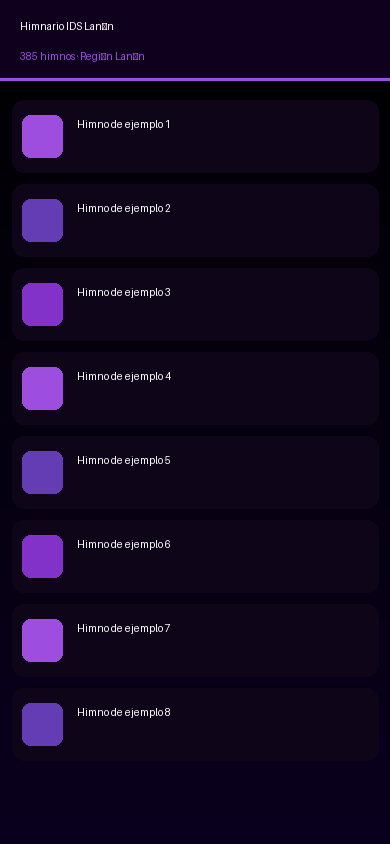

# Himnario Digital IDS Lanín

**Progressive Web App** para el Himnario de la Iglesia del Señor – Región Lanín.  
385 himnos con búsqueda inteligente, favoritos persistentes y modo lectura offline.



---

## Características

| Funcionalidad | Descripción |
|---|---|
| **Búsqueda Fuzzy** | Ignora tildes y tolera errores menores (Levenshtein) |
| **Favoritos** | Persistidos en `localStorage`, accesibles offline |
| **Modo Lectura** | Fuente ajustable (12–26px), navegación por swipe |
| **Offline** | Service Worker con 3 estrategias de caché |
| **PWA Instalable** | `manifest.json` completo con 12 tamaños de ícono |
| **Diseño AMOLED** | Fondo `#000000`, acento `#9d4edf`, animaciones CSS |
| **Accesibilidad** | ARIA labels, foco visible, `prefers-reduced-motion` |

---

## Estructura del Proyecto

```
himnario-ids-lanin/
├── index.html              # Punto de entrada HTML5
├── manifest.json           # Configuración PWA
├── sw.js                   # Service Worker (caché offline)
├── .gitignore
├── README.md
│
├── css/
│   ├── base.css            # Variables AMOLED, reset, utilidades
│   ├── navbar.css          # Barra de navegación y búsqueda
│   ├── cards.css           # Tarjetas de himnos (grid y lista)
│   ├── modal.css           # Modal de lectura
│   └── animations.css      # Animaciones y transiciones
│
├── js/
│   ├── app.js              # Módulo principal (orquestador)
│   ├── search.js           # Búsqueda fuzzy + normalización
│   ├── storage.js          # localStorage (favoritos, prefs)
│   └── renderer.js         # Generación de HTML dinámico
│
├── data/
│   └── canciones.json      # Base de datos de himnos ← REEMPLAZAR
│
└── icons/
    ├── icon-16.png … icon-512.png   # Íconos PWA
    ├── icon-512-maskable.png        # Ícono maskable Android
    └── screenshot-mobile.png        # Captura para manifest
```

---

## Formato de `canciones.json`

El archivo debe ser un **array JSON** con la siguiente estructura:

```json
[
  {
    "id": 1,
    "numero": 1,
    "titulo": "Santo, Santo, Santo",
    "categoria": "Adoración",
    "letra": "Santo, Santo, Santo\nSeñor Omnipotente\n\nCoro\nSanto, Santo, Santo\n..."
  }
]
```

### Reglas de formato de la letra

- Separar estrofas con **una línea en blanco**.
- Marcar el coro con la palabra `Coro` o `Estribillo` en su propia línea.
- Marcar puentes con `Puente` o `Bridge`.

---

## Prueba Local

### Opción 1: Python (recomendado, sin instalación)

```bash
cd himnario-ids-lanin
python3 -m http.server 8080
```

Abrir: [http://localhost:8080](http://localhost:8080)

> **Importante:** El Service Worker requiere un servidor HTTP. No funciona abriendo `index.html` directamente desde el sistema de archivos (`file://`).

### Opción 2: Node.js con `serve`

```bash
npx serve . -p 8080
```

### Opción 3: VS Code Live Server

Instalar la extensión **Live Server** y hacer clic en "Go Live".

### Verificar la PWA en Chrome DevTools

1. Abrir DevTools → pestaña **Application**
2. En **Service Workers**: verificar que `sw.js` esté activo
3. En **Manifest**: verificar que todos los íconos carguen
4. En **Cache Storage**: ver los 3 cachés (`himnario-shell-v1.0.0`, etc.)
5. Activar **Offline** en la pestaña Network y recargar → debe funcionar

---

## Despliegue en GitHub Pages

```bash
# 1. Crear repositorio en GitHub
git init
git add .
git commit -m "feat: Himnario Digital IDS Lanín v1.0"
git branch -M main
git remote add origin https://github.com/TU_USUARIO/himnario-ids-lanin.git
git push -u origin main

# 2. Activar GitHub Pages
# Settings → Pages → Branch: main → Folder: / (root) → Save
```

La app estará disponible en: `https://TU_USUARIO.github.io/himnario-ids-lanin/`

> **Nota:** GitHub Pages sirve sobre HTTPS, requerido para el Service Worker.

---

## Reemplazar los Datos Reales

```bash
# Copiar tu base de datos real
cp /ruta/a/tu/canciones.json data/canciones.json

# Verificar el formato
python3 -c "
import json
with open('data/canciones.json') as f:
    data = json.load(f)
print(f'Total himnos: {len(data)}')
print(f'Primer himno: {data[0]}')
"
```

---

## Tecnologías

- **HTML5** semántico con ARIA
- **CSS Grid** + Custom Properties (variables CSS)
- **Vanilla JavaScript** ES Modules (sin frameworks)
- **Service Worker API** para caché offline
- **Web Share API** para compartir himnos
- **IntersectionObserver** para carga infinita
- **localStorage** para favoritos y preferencias

---

## Licencia

Uso interno — Iglesia del Señor, Región Lanín.
